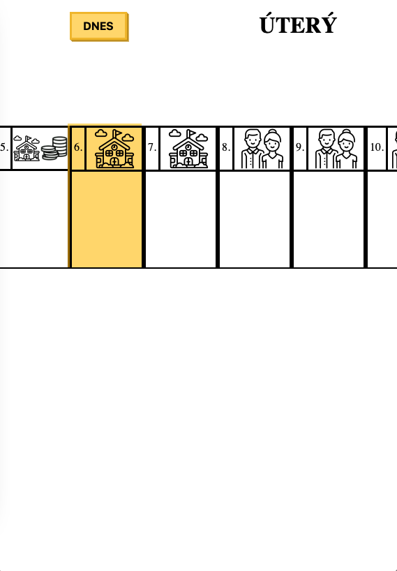
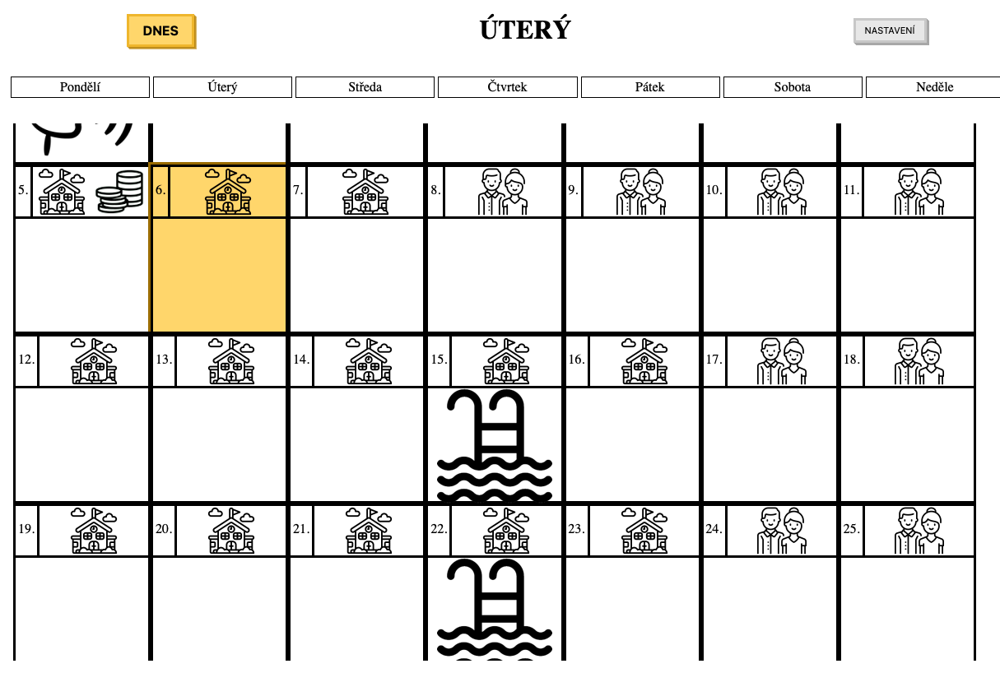

# Calendar

## Main goal
1. Create calendar for your kids, with images for easy understanding. Store data on server so that you and your kid can access it by web




## Limitations
- Support is only for the current year. funcionality across years was not seen as important
- Images name cannot contain `_` character

## How to use
1. You have to manually create `data.json`. Everything in `data.json` will be visible, so its good practise to delete old months
   - Or you can use `create_data.py` for generating `export.json`. You can copy all items from "dictionary" inside `data.json` into `export.json` and then renaming `export.json` to `data.json`.
2. Upload everything (`data_template.json` is not necessary) to your server and access the page by web browser
3. When the page is accessed by kid, no event can be modified (only viewed). The kid will see current day with events
4. when on bigger screen (for example PC / landscape mode), in upper right corner a settings button is visible. When you click on day, you can set events for that day. When new events are confirmed, data are send to `setData.php` on server and saved to `data.json`
   - You can also access this by appending to url, so that the URL looks like: `index.html?manage=true`
5. When you want to create next month, you have manually modify `data.json` stored on server
   - Or you can use `create_data.py` for generating `export.json`. You can copy all items from "dictionary" inside `data.json` into `export.json` and then renaming `export.json` to `data.json`.

- You can use it without PHP `setData.php` as only viewer of data.json. You will not be able to modify the events through web page, but only by manually changing `data.json`.

## Structure

- `data.json` - data
- `data_template.json` - template for `data.json`
- `create_data.py` - generates `export.json` with given months. Months are given as arguments from command line. `export.json` is created only with two basic events and is intended to be used as `data.json`
```bash
#creates json with data for whole year
> python create_data.py 1 12 #Windows
user$ python3 create_data.py 1 12 #Linux / MacOS
```
- `setData.php` - light PHP script, that receives data in JSON format and rewrites `data.json`. If not used, you cannot change events from within the web page and only can 

- `main.js` - called from `index.html` as starting script. It drives usage of data fetching, creating of HTMLDOM and usage of `manage.js`.
- `calendar.js` - objects `Day{}`, `Month{}`, `Data{}` and function `getData()`
 - `getData()` - fetch `data.json` and return newly created `Data{}` object
 - `Data{}` - stores fetched data, and function for creting `Month{}` objects
 - `Month{}`- creates `Day{}` objects
 - `Day{}` - holds data and can create HTMLDOM element
- `htmlDOMcreate.js` - creates HTMLDOM structure as `<li></li>` for every day. Positiong of dates is done by inserting null dates at the start. When data are modified, script refreshes the DOM structure.
- `manage.js` - adds managing functionalities, like add / remove events on dates. It is used only if necessary
- `index.html`, `style.css` - frontend...

- `/icons` - folder, where all the icons for given events are stored. You can add / remove as you want, but have to declare it in the `data.json`